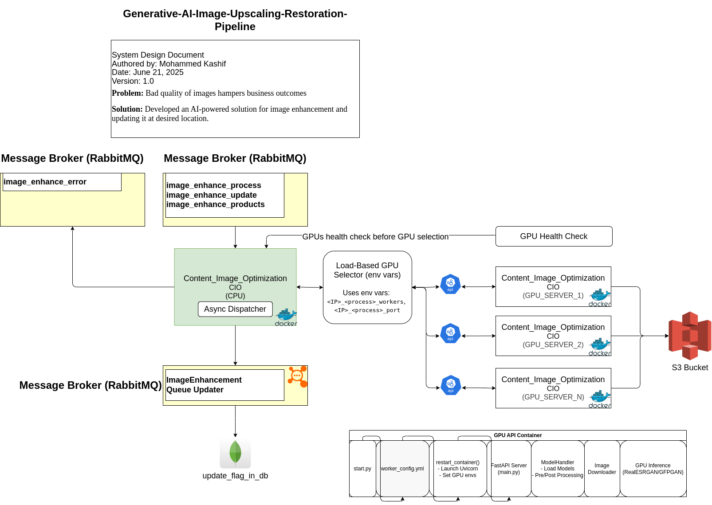

# Generative-AI-Image-Upscaling-Restoration-Pipeline

- This is common codebase for CPU based as well as GPU based docker container. Use [`Dockerfile_cpu`](./Dockerfile_cpu) and [`docker-compose_cpu.yml`](./docker-compose_cpu.yml) for CPU container. While for GPU container use [`Dockerfile_gpu`](./Dockerfile_gpu) and [`docker-compose_gpu.yml`](./docker-compose_gpu.yml).

- Set the server ip `SERVER_IP` and its process name `PROCESS` in respective docker-compose files.

- Based on the load on the GPU, manage GPU worker from file [`worker_config.yml`](./api/worker_config.yml) file. You can update following parameters on runtime:
    1. Worker count
    2. GPU memory limit per worker process

### Some basic commands:
#### Build docker image:
```bash
docker compose -f docker-compose.yml build
```
#### Build docker container:
```bash
docker compose -f docker-compose.yml up -d 
```

#### Enter into docker container:
```bash
docker exec -it content_image_optimization bash
```
#### Add Google DNS server in the file "/etc/resolv.conf":
```bash
echo "nameserver 8.8.8.8" | tee -a /etc/resolv.conf && \
echo "nameserver 8.8.4.4" | tee -a /etc/resolv.conf
```
This will allow the model to get download from git repos
### System Design:


### GPU API format:
Request format:
```bash
{
    "image_url": "https://www.wow.com/abc.jpg",
    "org_image_url": "https://www.wow.com/abc-org.jpg",
    "image_type": "general"
}
```
Request Nodes
- image_url - url on which enhanced image to be uploaded using S3
- org_image_url - url from which image to be enhanced is taken
- image_type - it can be "general", "face" or "text"

image_type:

* "face": "GFPGANer",
* "text": "RealESRNet_x4plus",
* "general": "RealESRGAN_x4plus"
Response format:
```bash
{
    "error_code": 0,
    "err": null,
    "message": "Image optimization request processed successfully"
}
```

### AI-Model details:

#### [Model link, click here](./modelReadme.md)

## sampling / inference 🔍 Local Image Enhancement (No API):

Use this script to test image enhancement directly with the model handler, without running any server.

---

[Inference file](./sample.py)
#### ▶️ Example Command
```bash
python sample.py \
  --image_url "https://cdn.example.com/image-enhanced.jpg" \
  --org_image_url "https://cdn.example.com/image-original.jpg" \
  --image_type "general" \
  --force 1 \
  --memory_limit 4 \
  --output_dir "./output"
```

## Todos:
1. Images with higher resolution will need higher memory usage. It create `out of memory` issues. To solve this, need to implement tiling mechanism. 

2. Finetune RealESRNET for better text quality intact in enhanced image containing text.

3. Validation parameter need to be added in order to approve/reject the enhanced image.
