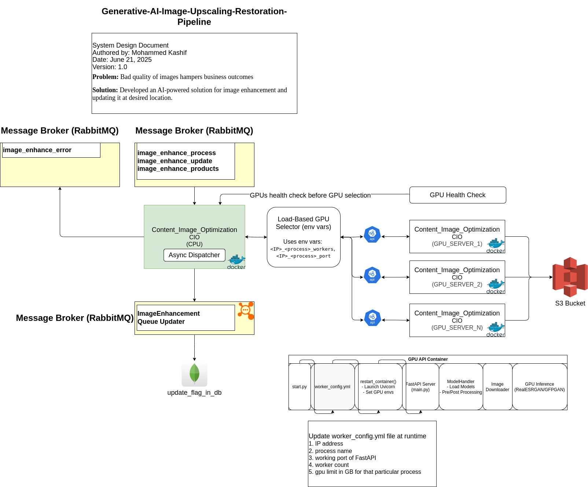

# Generative-AI-Image-Upscaling-Restoration-Pipeline

### Some basic commands:
#### Build docker image:
```bash
docker compose -f docker-compose.yml build
```
#### Build docker container:
```bash
docker compose -f docker-compose.yml up -d 
```

#### Enter into docker container:
```bash
docker exec -it content_image_optimization bash
```
#### Add Google DNS server in the file "/etc/resolv.conf":
```bash
echo "nameserver 8.8.8.8" | tee -a /etc/resolv.conf && \
echo "nameserver 8.8.4.4" | tee -a /etc/resolv.conf
```
This will allow the model to get download from git repos
### System Design:


### GPU API format:
Request format:
```bash
{
    "image_url": "https://www.wow.com/abc.jpg",
    "org_image_url": "https://www.wow.com/abc-org.jpg",
    "image_type": "general"
}
```
Request Nodes
- image_url - url on which enhanced image to be uploaded using S3
- org_image_url - url from which image to be enhanced is taken
- image_type - it can be "general", "face" or "text"

image_type:
```bash
{
    "face": "GFPGANer",
    "text": "RealESRNet_x4plus",
    "general": "RealESRGAN_x4plus"
}
```

Response format:
```bash
{
    "error_code": 0,
    "err": null,
    "message": "Image optimization request processed successfully"
}
```

# AI-Model details:

### [Model link, click here](./modelReadme.md)
